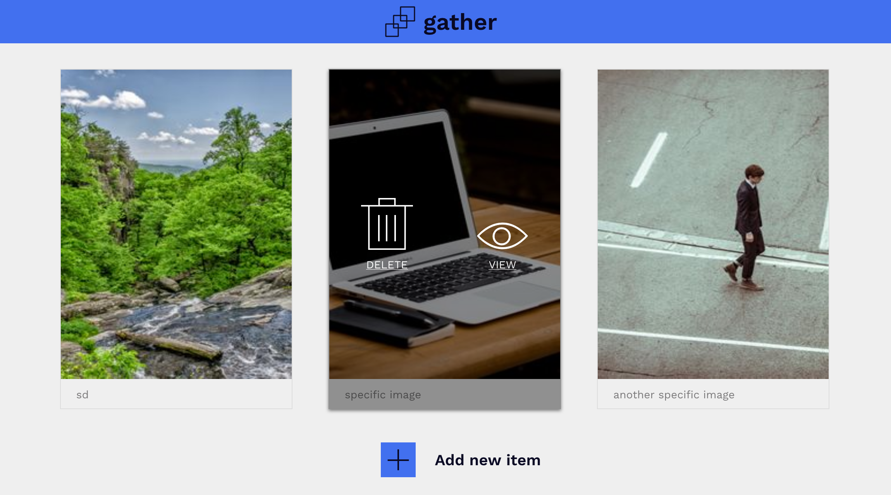

## gather-codecademy

#### Description
Simple photo gathering application which includes **CRD (Create-Read-Destroy)** functionality. Completed as a homework assignment for Codecademy Test-Driven-Development (TDD) online course.

#### Technology

- Node.js
- Express
- Mocha & Chai
- WebDriverIO
- phantomJS
- SuperTest
- Mongoose & MongoDB

#### Setting Up

- requires Node.js and MongoDB to be installed

1. `git clone git@github.com:kevcom/gather-codecademy.git`
2. `cd gather-codecademy`
3. `mongod --dbpath ./db`
4. `npm install`

#### Running

- **TESTS** (Because TDD is awesome): `npm test`
- **SERVER**: `npm start`